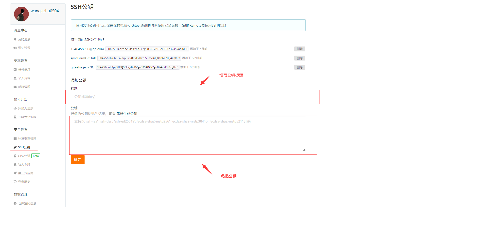
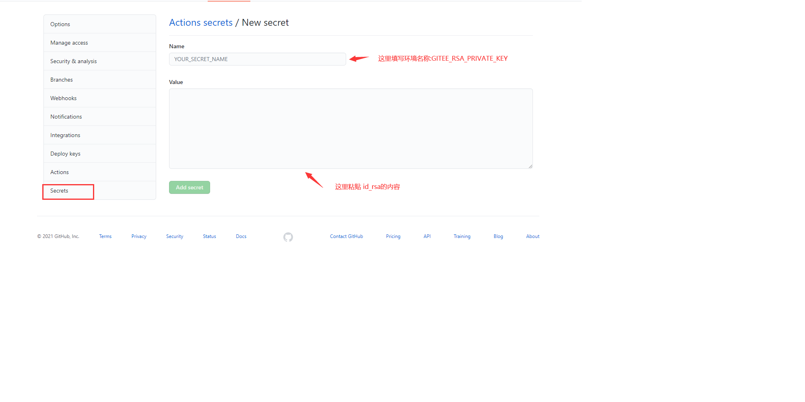

## github 部署到gitpage(源自github-pages-deploy-action)

  这个 GitHub Action 会自动将你的项目部署到 GitHub Pages。它可以配置为将生产级代码推送到任何您想要的分支，包括 gh 页面和文档。它还可以处理跨库部署。

### 参数配置

```yml
name: Build and Deploy
on: [push]
jobs:
  build-and-deploy:
    runs-on: ubuntu-latest
    steps:
      - name: Deploy To GitHubPage
            uses: Biscuit0504/githubpages-action@master
            with:
              ssh-key: ${{ secrets.GITEE_RSA_PRIVATE_KEY }}
              repository-name: Biscuit0504/Biscuit0504.github.io
              branch: master
              folder: build
```
### 设置私钥 
  里说下如何生成 RSA 的公钥和私钥。

  打开终端，输入以下命令：

  ```
    ssh-keygen -t rsa -C "xxxxx@xxxxx.com" 
  ```

  > 注意：这里的 xxxxx@xxxxx.com 只是生成的 sshkey 的名称，并不约束或要求具体命名为某个邮箱。
  > 现网的大部分教程均讲解的使用邮箱生成，其一开始的初衷仅仅是为了便于辨识所以使用了邮箱。

  按照提示完成三次回车，即可生成 ssh key。通过查看 ~/.ssh/id_rsa.pub 文件内容，获取到你的 public key，其中私钥就是 id_rsa，公钥就是 id_rsa.pub，这就是密钥对，一个可用于加密，另一个可用于解密。
  ```
    cat ~/.ssh/id_rsa.pub
    # ssh-rsa AAAAB3NzaC1yc2EAAAADAQABAAABAQC6eNtGpNGwstc....
  ```
  
  

  打开gitee.com并登录，点击自己头像右下角，选择设置-> ssh 公钥，将 id_rsa.pub 的内容复制到公钥的输入框里，公钥的标题可以自己填写，如下图所示：

  
  
  接下来设置 secrets.GITEE_RSA_PRIVATE_KEY ，在 GitHub 上打开仓库 1 的设置页面，点击 secrets，增加环境变量，name 就填写 secrets.GITEE_RSA_PRIVATE_KEY，value 就填写 id_rsa 文件的内容，如下图所示：
  

### 参考
  
  [github-pages-deploy-action](https://github.com/JamesIves/github-pages-deploy-action)